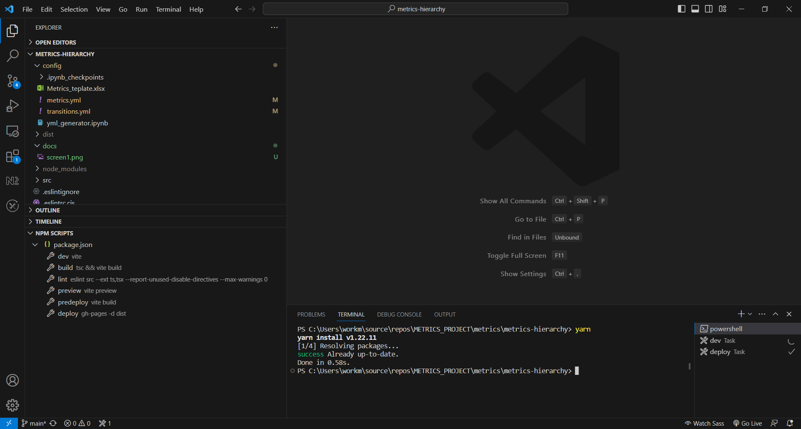
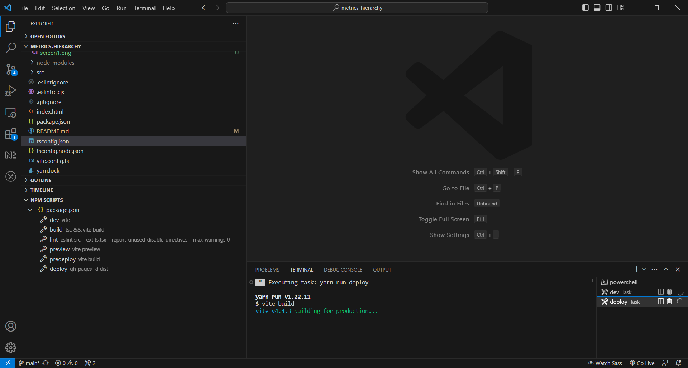

# metrics-hierarchy

metrics hierarchy app with front and back for simple work with it

## Как обновить граф

1. Склонировать репозиторий: запустить в терминале `git clone https://github.com/aa-tolmachev/metrics-hierarchy.git`

2. [Установить](https://classic.yarnpkg.com/lang/en/docs/install/) yarn, если он не установлен

3. Установить пакеты в репозитории: запустить в терминале `yarn`

4. Обновить `config/metrics.yml` и/или `config/transitions.yml`

5. Запустить в терминале `yarn deploy`

6. Проверить, что новая версия приложения задеплоилась на Github Pages на странице [Deployments](https://github.com/aa-tolmachev/metrics-hierarchy/deployments/github-pages)

7. Перейти на [страницу](https://aa-tolmachev.github.io/metrics-hierarchy) с задеплоенным приложением
